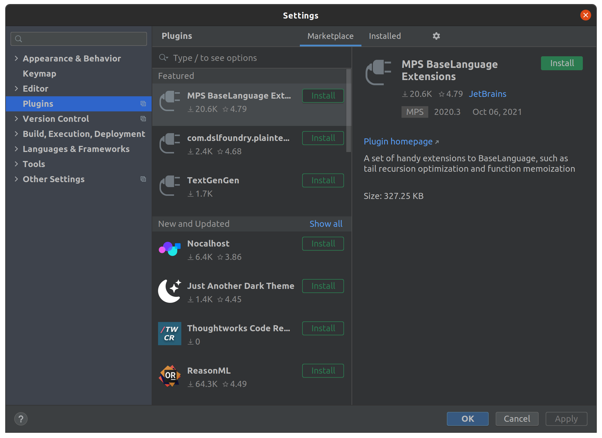
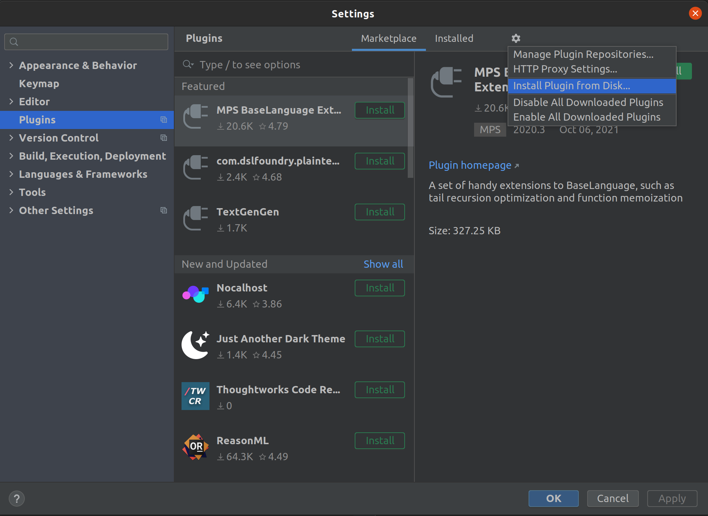
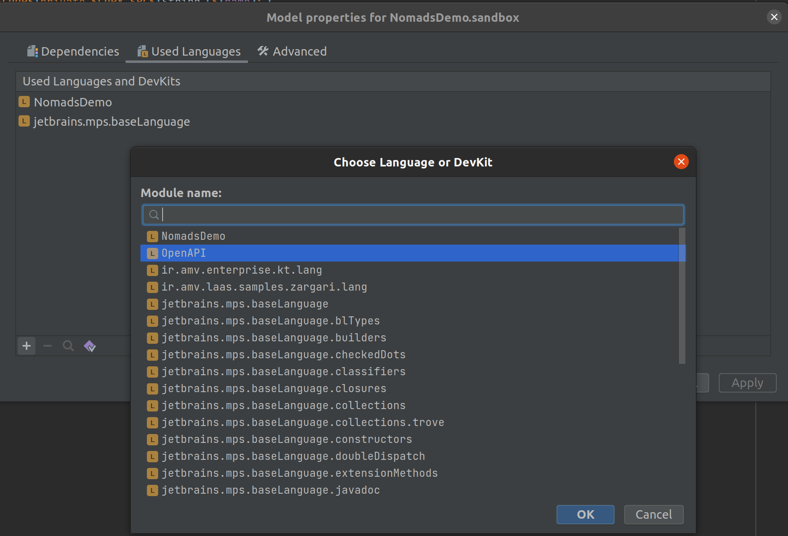

# openapi-mps
A MPS Language for OpenAPI. This language could be used to express REST integration specification, and in the end it
will be translated to an OpenAPI spec file (for now!).

## Installation
Assuming you have downloaded and installed Jetbrains MPS 2020.3 from 
[here](https://www.jetbrains.com/mps/download/previous.html)
, you can [download](https://github.com/LoCoRepo/openapi-mps/releases) latest version of this project which is a zip
file. Then go to the Settings menu on MPS and click on "Plugins"

Then click on the  and select "Install Plugin from Disk" option

Now select the "OpenApiMps.zip" file you downloaded previously, and press OK from the Dialog. You will be asked to 
restart MPS, select "Restart" and wait for MPS to be restarted completely.

Now you have the support for OpenAPI MPS Language! So if you have an MPS model, and try to add a language to use, you
will see a new language shown:

## Usage
Who reads documents nowadays? Just watch this [short video](https://youtu.be/dZc_NI0GCN4) instead!
